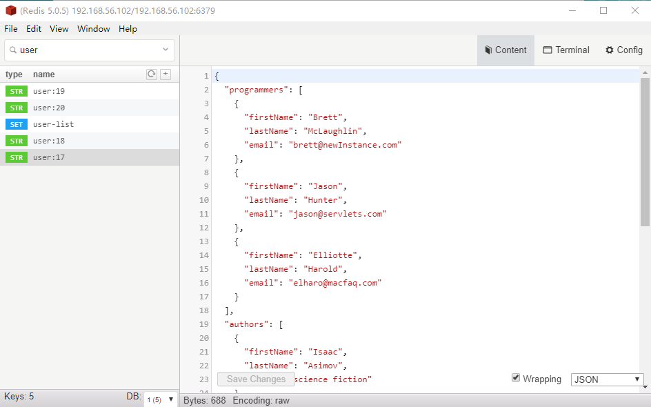
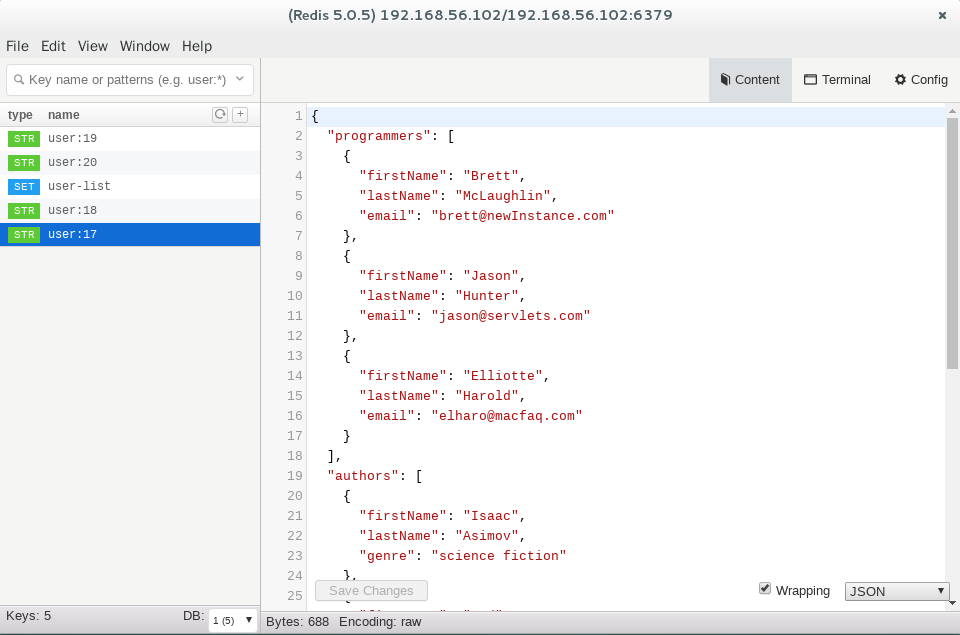

# medis-binaries

Medis binaries for Windows and Linux platforms.

[](https://github.com/liying2008/medis-binaries/releases)
[](https://github.com/liying2008/medis-binaries/releases)

- Source code: [https://github.com/luin/medis](https://github.com/luin/medis)

- Source code license: [https://github.com/luin/medis/blob/master/LICENSE](https://github.com/luin/medis/blob/master/LICENSE)


## Download

**Please go to the [release page](https://github.com/liying2008/medis-binaries/releases) to download the binaries.**

The latest version is 1.0.3 .

- **Run on Windows10**



- **Run on Debian 8.4**




**NOTE:**

If you report an error while running on Debian or Ubuntu, execute the following command :

```
sudo apt-get install libgtkextra-dev libgconf2-dev libnss3 libasound2 libxtst-dev
```
